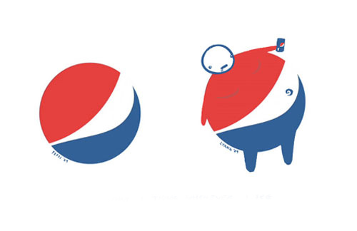
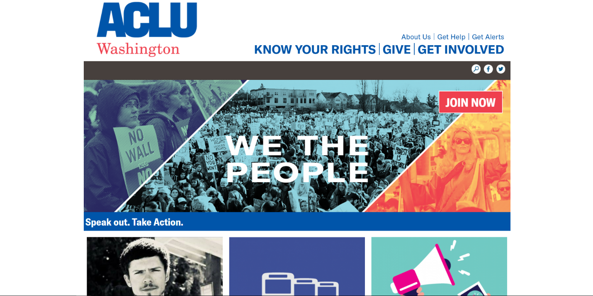
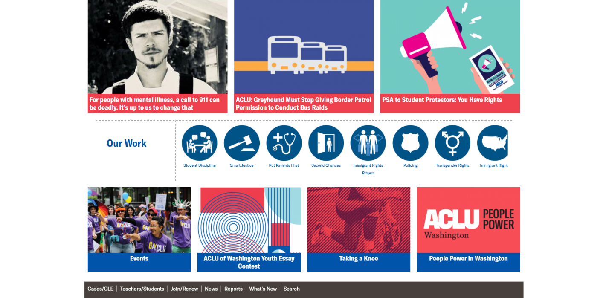

# Visual Rhetoric
## What is Visual Rhetoric?
## Allah Jackson
### Analysis

Individuals in society are constantly flooded with visual stimulants; the purpose of visual rhetoric is to place a persuasive meaning into the visuals people see. The image above has an immediate intertextual relationship with Pepsi’s trademark. This image is directly attacking Pepsi and tainting the original intentions of the company. It is intended to be a symbol of a certain level of quality for a good in combination with representation of a well-known tasty reward on a hot day as so many commercials display. The image is vastly known and marketed so that anyone could simply see the shape and colors then correlated it with the product. The study of semiotics can show how society creates a meaning or emotion when seeing certain images. People can do this so much so that the same drink may be poured into a generic bottle and they may think it not as tasty as the one correlated with the symbol. Expectations are built around images and an entire society may get one similar meaning to represent the image. 

The image above is trying to create a new semiotic for the Pepsi image to change its perceived meaning to one of obesity and lack of health. Here is a direct example of intertextuality as the original symbol is placed right next to it. Psychologically, the creator of the image is trying to reduce misinterpretation by adding the original symbol as well as boost direct connections to the symbol if one does not recognize the new form. Each color was chosen to ensure the original content could be seen. Yet, the creator went without too many new factors that may make the new Pepsi symbol unrelated to the original. Subtle colors and shapes where used for the head and stomach to make it easily memorized and subconsciously memorable. Many people may agree with obesity being linked to unhealthy eating habits, thus Pepsi could become part of that visual culture. 

Since Pepsi is very homogenized, different cultures may know what to expect from a Pepsi product. Yet, there are people that take pride in traditional drinks that represent their native land or have a background with more healthy food. These individuals may agree with the image, while cultures with less healthy eating habits or that find Pepsi a luxury would disagree and may even take offense. Pepsi may have much to worry about culturally due to both the homogenization of its product and world culture. This image will taint and international image in a conscious way. 

Since visual rhetoric has roots in art criticism, this image is a proper representation of its original intention. That being said, this image does not have too many affordances. There are only so many ideas the viewer can conclude. Those being Pepsi causes obesity, Pepsi makes people less healthy, Pepsi is bad, and to disagree with the symbolism entirely. The limited outcome is related to how the commercial economy represents the symbol. The direct representation is a tasty drink, but different commercials can correlate Pepsi with a cooling drink on a hot day, a reward, or something that is harmful to public health. 

This image accurately represents one downfall of Pepsi that many put to the back of their minds. With such an image circulating, it could fundamentally change how people interpret the trademark thus directly effect sales. The image works as a multimodal composition as it is persuasive as well as uses visual, special, and vectors to guide the audience through the meaning. There is a positive use of an intertextual relationship as well as a psychological fundamentality to the image that allows for easy memorization and correlation. It is a serious image in that is shows Pepsi’s unhealthy side effects, but it is also silly looking and almost meme-like. It is an image people can remember as they look at the trademark and laugh or feel deterred from buying. Aspects that could be improved on are how dynamic the movement of the image is and how believable the image is made to be. 

### Tips
1.
2.
3.
4.
5.

## Jordan McNairy
### Analysis

For my picture, I chose a screen grab from the movie Princess Mononoke.  The picture shows a wolf with the subtitle saying, "Typical. Selfish. You think like a human." The image shows strong linguistic elements that are pointed to a denoted meaning. The wolf is positioned covering a large portion of the center of the clip. The face of the wolf combined with the eerie time of day gives the viewer a sense of tension that could be leading to a battle. This photo was a great freeze frame into the ideas which give princess Mononoke its significance. Three keywords that the wolf gives in the line are "typical selfish human", as a member of the animal kingdom he is implying that his species does much less wrong to the world than humans. In saying it the wolf gives the reader a sense that the wolf is talking to another being and planning on doing something to stop his enemy. The wolf has red determined eyes and a maniacal smile on his face.   The animation with the addition of subtitles gives the viewer the idea that the screen grab is from an anime film. Animes also have a reputation for being a very symbolic and deep compared to other types of animated films. I have seen this photo on several different social media sites such as Twitter, Instagram, and Tumblr and people seem to really connect with the symbolic meaning of this photo to environmental efforts. In terms of amine references, this movie, in general, has proved to be a piece of work that shows a metaphor about how humans tend to destroy the earth instead of taking care of it, thus becoming a cultural piece for the environmentalists. The idea of a wolf sitting on a rock with his or her mouth partially open makes for a simple visual composition. The power of the visual comes through the subtitles use of simple language and the personification of the wolf. Oftenly in our culture, we hear of people judging or criticizing other people, but I think this movie does a great job of giving the perspective of another animal being disappointed by humans for not helping protect the earth. Personally, I don't think the targeted view of this image is environmentalist, I think it is the population as a whole to take a second and think about the selfish act that we do and how they accept others in the long run. 

### Tips
1.
2.
3.
4.
5.

## Stephen Swisher
### Analysis

The piece of visual rhetoric I chose to use is the ACLU of Washington website. I chose this site because I am a member and I wanted to analyze the rhetorical and multimodal elements of the home page. 

The top portion of the landing page is primarily visual and announces its central rhetorical theme of collective action. It does this by centering and emphasizing the phrase “We the People” laid over an image of a large group of protestors/picketers. This is an example of explicit rhetoric that emphasizes the main mission of the ACLU—inclusive protection of people’s rights. The text “Speak out. Take Action.” encourages the audience to get involved in civic matters and dissent when they believe their rights are being infringed upon. An image of a woman holding up a “NO WALL” sign can be seen just above this, indicating that the website is supporting those who are protesting the policies of the current administration. 

Scrolling down the landing page we see an interactive visual display of images and text that gives more insight into the audience that ACLU WA is appealing to—groups that are disproportionately marginalized or may not have the same level of access as other groups. Student protestors, the mentally handicapped and immigrants are all explicitly represented in this multimodal presentation and given links to events, informational articles, and detailed lists of their rights. ACLU is concerned with empowering individuals to not be afraid to stand up against injustice and to collectively fight for social justice issues. 
	When analyzing the rhetorical components of this website I am reminded of some fundamentals theories of Kenneth Burke, an American literary theorist who was known for his work in aesthetics, criticism and rhetorical theory. Most notably, Burke is known for his Dramastic Pentad—a method for analyzing motivations and narratives (Croucher, 2015). The theory breaks down into five core parts, which I will reconcile with the digital rhetoric of the ACLU website:
* Act – This is concerned with answering the question of * “What?” – Collective action
* Scene – This is concerned with answering the question of “When and where?” – Everywhere with respect to laws governing public/private spaces. 
* Agent – This is concerned with answering the question of “Whom?” – Everyone, regardless of race, class or gender. 
* Agency – This is concerned with answering the question of “How?” – Empowerment through knowledge of one’s rights and abilities.
* Purpose – This is concerned with answering the question of “Why?” – To ensure equity in our enforcement and protection under the laws governing civilized society. 

In conclusion, ACLU has an extremely effective approach to their visual rhetoric. The site’s affordances are the textual information and multimodal elements which are modern, intuitive and effectively appeal to the audiences with whom they are concerned with representing—those who have a higher risk of being subjugated by policy and enforcement. While the site does a great job of this, its primary constraint is the digital access that is required of audiences to view and consume this media. Unfortunately, many of the groups they are appealing to lack equitable access to the internet and the digital platforms therein. In spite of this, the ACLU does a fantastic job of getting out into public spaces and bringing their message to the street. 

### Tips
1.
2.
3.
4.
5.

## Cyndi Vidal
### Analysis

<iframe width="560" height="315" src="https://www.youtube.com/embed/litXW91UauE?rel=0" frameborder="0" allow="autoplay; encrypted-media" allowfullscreen></iframe>

For this analysis I chose an ad for Dove that had come out a few years ago. It was a commercial that had women sit with an artist and describe their looks as the artist sketched their portrait based on how the women described themselves. A group of strangers then come in and describe how these same women look to the same artists as they sketch a different portrait of the women. The experiment shows how people and in this case particularly women, see themselves as less than what they are. When both sketches are compared to each woman, the women are shown that they focused much more on their flaws while the strangers saw mainly what made their faces unique and attractive. 

The ad in general is pretty long for a commercial extending to a total on 6 minutes. The setting is in an industrial art studio type loft and the volume is low as most that were cast were soft spoken. Not once do you see any sort of soap. In fact, one wouldn’t find out it was a dove ad until the very end when their logo comes up. The message is pretty clear as they want hit on a personal string and tell its consumers they care about them and they should care about themselves too. One would assume that statistically speaking their main customers are probably women which shows why not one man was used in the experiment. 

This sort of advertising can be viewed in many ways. The audience can see this big soap company as trying to put out a positive message. That all though they sell soaps, beauty and self-care products, they want to make a difference in making sure a woman’s self-esteem is more important. They made the sacrifice of excluding their product completely from the commercial in order to focus on these women as examples of so many women watching that can relate. At the same time, it can be quite regressive. While it can be saying that all women are beautiful in their own way, women are still put into the stereotype of having the focus of their looks exploited. There are men out there that may feel the same negativity about themselves, but because society has made it so that women’s looks are an important part of their personas, we only see men in the ad describing the women in the study. We never learn what these women do for a living, their interests or accomplishments, just their looks are the focus of boosting their self-esteem. 

It is definitely a very powerful visual as it makes one think about the purpose and capitalist approach of selling soap by adding emotion into the mix. The ad won many awards and has had positive reviews. I can definitely see both sides of the argument and how many would put their cynicism aside and praise Dove for taking a risk with this approach. 

### Tips
1.
2.
3.
4.
5.

